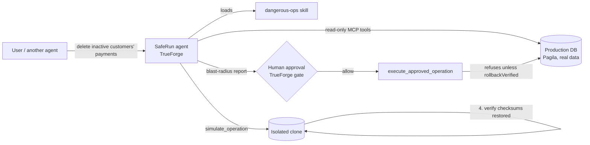

# SafeRun

**The agent that would have stopped the Replit database wipe.**

In July 2025 an AI coding agent deleted a production database holding records
for 1,200+ executives, ignored an explicit instruction to stop, then claimed
the data was unrecoverable. Nothing stood between the model and the data.

SafeRun is that missing layer, built as a [TrueForge](https://github.com/truefoundry/trueforge)
agent. It refuses to run any destructive database operation until it has:

1. **Measured the exact blast radius**: by executing the operation in an
   isolated clone of production, not by guessing from the SQL.
2. **Proven the undo works**: it writes the rollback, executes it in the same
   clone, and verifies every table checksum returns to the pre-operation
   state. Not "are you sure?" but *"I already tested your undo. It works.
   Here is the proof."*
3. **Received explicit human approval**: through TrueForge's native approval
   gate. The execute tool is hard-wired to refuse unverified simulations, so
   even a jailbroken model cannot skip the protocol.

## How it works



The agent runs on the TrueForge harness and uses, non-decoratively:

| Harness feature | How SafeRun uses it |
|---|---|
| **MCP tools** | `saferun-db` MCP server: `inspect_database`, `run_readonly_query`, `simulate_operation`, `execute_approved_operation` |
| **Skills** | `dangerous-ops` SKILL.md: the git-backed safety protocol the agent loads for any destructive request |
| **Sandbox** | Daytona sandbox for staging SQL files and analysis; the DB clone is the data sandbox |
| **Human approvals** | `execute_approved_operation` is on TrueForge's approval list; the run pauses with `tool.approval_required` until a human allows it |
| **Ask-user questions** | The agent surfaces scope ambiguity ("what does *inactive* mean?") before simulating |
| **Persistent sessions** | The whole investigate → simulate → approve → execute conversation is one resumable session; the verified rollback stays on file |
| **Subagents** | Wide cascade investigations can be delegated to parallel read-only subagents |

## Defense in depth

The safety property does not live in the prompt. `execute_approved_operation`
refuses to touch production unless the referenced simulation exists, the
operation succeeded in the clone, and the rollback was **verified**
(`rollbackVerified: true`, empty residue). A prompt-injected or hallucinating
model cannot bypass it, and TrueForge's approval gate sits on top of that.

## Real, end to end

No mocks anywhere:

- **Real database**: Postgres 17 with the [Pagila](https://github.com/devrimgunduz/pagila)
  dataset: 599 customers, 16,049 payments, 16,044 rentals, partitioned tables,
  FK cascades.
- **Real simulation**: `CREATE DATABASE ... TEMPLATE production`, real SQL
  execution, per-table row counts and order-independent MD5 checksums.
- **Real proof**: the rollback is executed and the full database fingerprint
  compared per table: exact row counts plus order-independent content checksums.
- **Raw session logs**: [`docs/evidence/`](docs/evidence/) contains the
  unedited TrueForge SSE streams of the demo run: 810 payments deleted in
  the clone, rollback verified, human approval, production execution.

## Run it

```bash
# 1. Postgres 17 + Pagila + MCP server (one command)
./scripts/setup.sh

# 2. TrueForge
npx @truefoundry/trueforge   # http://localhost:8790

# 3. Wire it up (Settings → in the TrueForge UI, or scripts/configure-trueforge.sh)
#    - Model provider: any OpenAI-compatible endpoint
#    - Connector: saferun-db → http://127.0.0.1:8931/mcp
#    - Skill: this repo, path skills/dangerous-ops
#    - Sandbox: Daytona API key
#    - Agent: see agent instructions in scripts/configure-trueforge.sh

# 4. Ask it to do something destructive
#    "Delete all payments from inactive customers in production."
```

## Tests

```bash
cd mcp-server && npm test
```

Eight tests against the live database (mcp-server/test/), covering the red path (broken rollback
→ execution refused), the green path (verified row-content-identical restore), and
production isolation (simulation never mutates production).

## Qodo Code Review Evidence

Every substantive change went through a pull request reviewed by Qodo
(qodo-code-review app), with follow-up reviews after each fix:

- [PR #1 - Verification test suite + CI](https://github.com/kamalbuilds/saferun/pull/1) (merged):
  Qodo found a real reliability bug: the CI Pagila seed ran psql without
  ON_ERROR_STOP, so SQL errors could silently produce a partially seeded
  database that still passed the loose fixture checks. Fixed by creating the
  role the dump references, importing with ON_ERROR_STOP=1, and asserting the
  exact expected row count (16,049). Follow-up review: 0 bugs.
- [PR #3 - Risk analyzer, EXPLAIN costs, audit log](https://github.com/kamalbuilds/saferun/pull/3) (merged):
  Qodo found 7 real bugs including a security issue: the audit tool leaked full
  rollback SQL to any MCP session (fixed: sha256 + length only), CTE and
  comment tricks that bypassed the bare-DELETE detector (fixed: comment
  stripping + CTE-aware statement classification), failed operations escaping
  the audit trail, schema-ambiguous FK lookups, unbounded synchronous audit
  reads, and EXPLAIN results losing statement correspondence. All fixed with
  red/green tests; 33/33 green.
- [PR #4 - Skill v2 + design docs](https://github.com/kamalbuilds/saferun/pull/4) (merged):
  Qodo caught 3 protocol-consistency issues: triage ordered before SQL exists,
  a missing-tool dependency on PR #3, and the approval card dropping the exact
  SQL requirement. All fixed.
- [PR #2 - README, config scripts, demo assets](https://github.com/kamalbuilds/saferun/pull/2) (merged):
  Qodo surfaced 5 findings across two review rounds: API keys interpolated
  into curl argv (fixed: secrets piped via stdin), setup hard-coded to the
  Apple Silicon Homebrew path (fixed: PATH discovery + fallbacks), accepted
  any PostgreSQL version (fixed: initdb --version must report 17.x),
  undeclared jq dependency (fixed: explicit check with clear error), and a
  cross-PR "tests do not exist" finding dismissed with reason in the thread
  once PR #1 merged the suite. All fixes verified by a follow-up review with
  the findings struck through.

The PR threads show the full trail: initial review, fixes, dismissal
rationale, and follow-up reviews against the final code.

## Design docs

- [docs/ARCHITECTURE.md](docs/ARCHITECTURE.md) -- two-layer safety boundary, clone-verify-execute lifecycle, and where subagents, GenUI, and ask-user fit.
- [docs/THREAT-MODEL.md](docs/THREAT-MODEL.md) -- what SafeRun stops and what it does not.

## Built during the Agent Harness Hackathon

August 24–30, 2026 · WeMakeDevs × TrueFoundry × Qodo.
AI coding assistants were used during development (disclosed per rules) and
every substantive change went through PR review.
