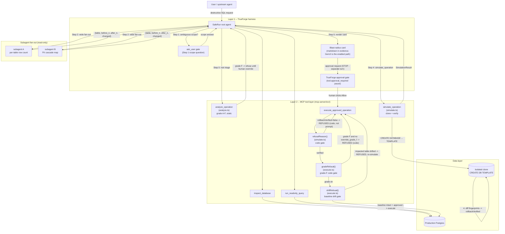

# SafeRun Architecture

SafeRun enforces two independent safety boundaries between an AI agent and
production data. Bypassing either one requires overriding both a prompt-level
gate and a compiled code check.

## Two-layer safety boundary



## Clone-verify-execute lifecycle

```
Request
  |-- Step 0: analyze_operation  (static, read-only)  -> grade
  |-- Step 1: ask_user           (scope gate)          -> clarified intent
  |-- Step 2: inspect + fan-out  (read-only subagents) -> blast map
  |-- Step 3: write SQL + rollback
  |-- Step 4: simulate_operation
  |     CREATE DB saferun_sim_<id> TEMPLATE production
  |     run operation  -> measure impact (row counts + MD5 checksums)
  |     run rollback   -> diff fingerprints
  |     rollbackVerified = (residue.length === 0)
  |     DROP DB saferun_sim_<id>              <- clone gone, production untouched
  |-- Step 5: blast-radius card + STOP        <- harness gate pauses here
  |     human approves (TrueForge approval gate)
  |-- Step 6: execute_approved_operation
        -> refusalReason() checks: sim exists? op ok? rollbackVerified?
        -> gradeRefusal()   checks: static grade F without override_grade_f?
        -> driftRefusal()   checks: impacted tables still match the baseline?
        -> if any check fails: REFUSED (code path, cannot be prompted away)
        -> if all pass: execute against production
```

## Where harness features plug in

| Feature | Step | Purpose |
|---|---|---|
| `analyze_operation` (MCP) | 0 | Static grade before any DB touch |
| `ask_user_questions` | 1 | Resolve scope ambiguity before clone |
| `dynamic_sub_agents` | 2 | Parallel read-only blast-radius mapping. Enabled and skill-orchestrated; fires in `docs/evidence/turn-v2-subagents.sse` |
| `simulate_operation` (MCP) | 4 | Real clone, real impact, real rollback proof |
| `generative_ui` | 5 | Enabled as the rendering path for the approval card. The committed evidence runs rendered it as a markdown table |
| TrueForge approval gate | 5-6 | Harness pauses run; human must click Allow |
| `refusalReason()` (code) | 6 | Gate 1: refuses if simulation not verified |
| `gradeRefusal()` (code) | 6 | Gate 2: refuses static grade F without an explicit override |
| `driftRefusal()` (code) | 6 | Gate 3: refuses if an impacted table drifted since simulation |
| `sandbox` | any | Stage SQL files, run data-analysis code |

## Two-layer defence in depth

Layer 1 (harness) stops the agent from ever reaching `execute_approved_operation`
without a verified simulation in the session.

Layer 2 (code gate) stops the tool itself from executing even if the harness
layer is bypassed. Three compiled checks run in order inside
`execute_approved_operation`:

1. `refusalReason()` in `mcp-server/src/simulate.ts` reads the in-process
   simulation store and refuses unless `rollbackVerified: true` is set on the
   referenced simulation id. Prompts cannot write to that store.
2. `gradeRefusal()` in `mcp-server/src/execute.ts` re-runs the static analyzer
   on the stored operation and refuses grade F unless the caller passed
   `override_grade_f: true`.
3. `driftRefusal()` in `mcp-server/src/execute.ts` re-fingerprints the impacted
   tables in production and refuses if any diverged from the simulation
   baseline.
